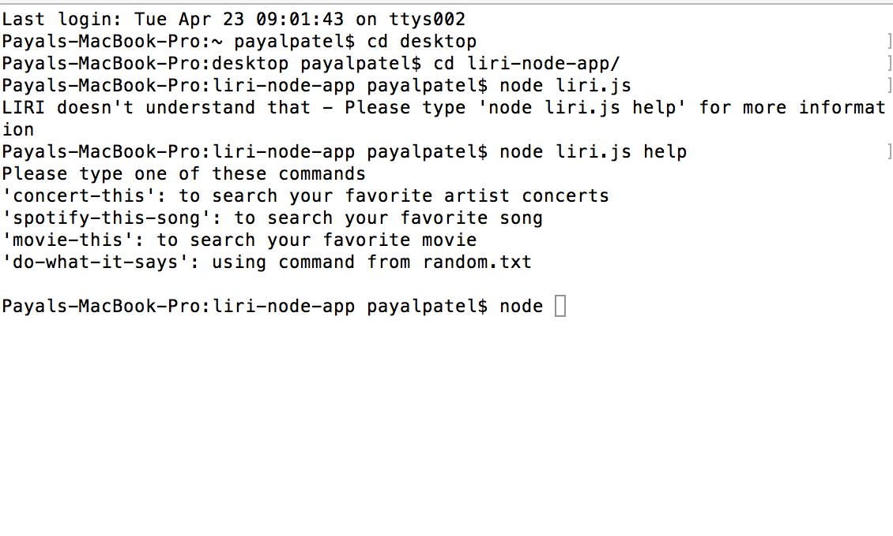
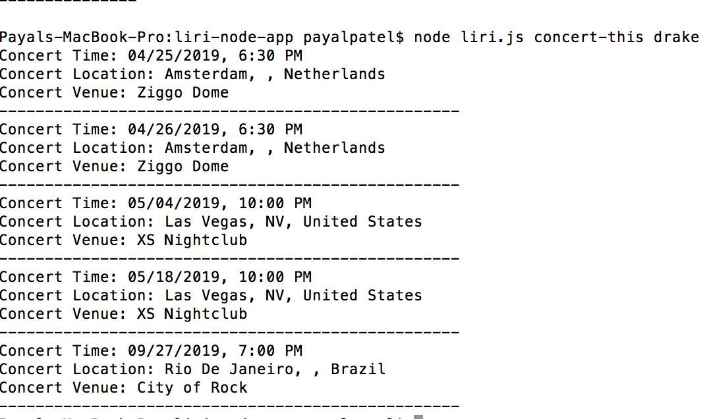
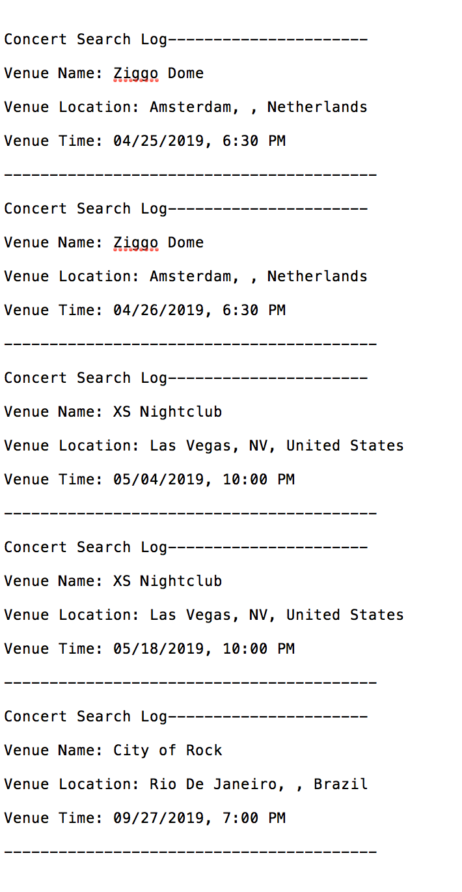
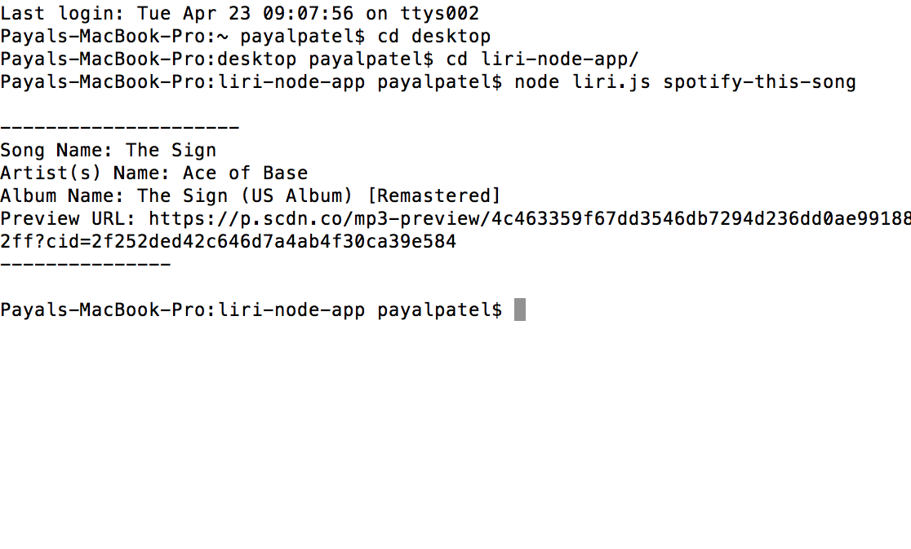
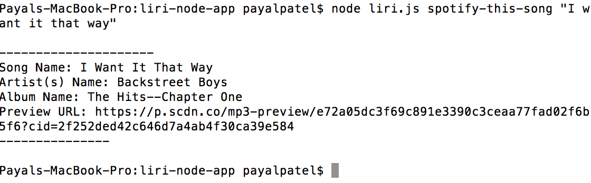
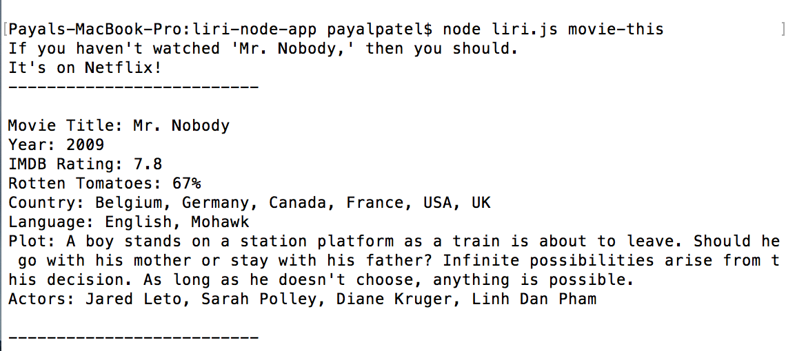

# Liri Bot
Hello all. Welcome to LIRI- LIRI is the cousin of SIRI.  However, while SIRI is a Speech Interpretation and Recognition Interface, LIRI is a Language Interpretation and Recognition Interface. LIRI is a node app that displays results via the command line.

## Demo
**First off:**

If you say "node liri.js help"- LIRI will actually give you a bunch of commands you can follow:

* "concert-this": to search your favorite artist concerts
* "spotify-this-song": to search your favorite song
* "movie-this": to search your favorite movie
* "do-what-it-says": using command from random.txt

## The "Concert-this" command

* when we use "concert-this" it will tell where your favorite artist will be playing (location and venue) as well as the time of the concert.
* also results from all searches LIRI undergoes will be logged into the log.txt file

## The "spotify-this-song" command

* the "spotify-this-song" will display the song name, artist, album name, as well as a preview URL.
* if user doesn't enter a song, the default is "The Sign" by Ace of Base.

## The "movie-this" command

* the "